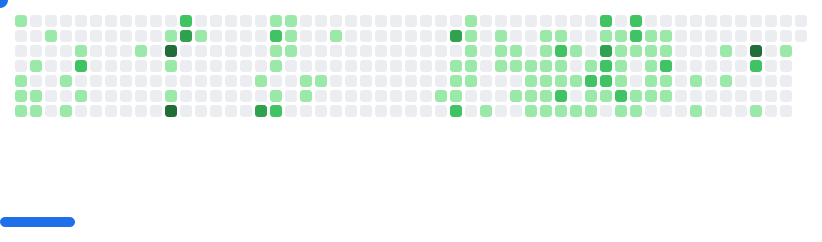

### Hello World, I'm Hieu Cao - aka **Harry** - aka *CodingHusk3y* 👋

  

## I'm a curious Developer, a serious Learner, and a motivated problem-solver!

- 🏫 I’m currently a Computer Science major at [Georgia State University](https://www.gsu.edu/)!
- 🌱 My desired career path is to become a Software Engineer. I believe that I can turn this aspiration into reality and succeed in my chosen field. 
- 👯 I’m looking to collaborate with other creators
- 🥅 2025 Goals:
  
✅ **`Goal 1`**: <strike>Have an internship.</strike>
* ✅ **`Goal 2`**: <strike>Participate in 3 hackathons 🏆</strike>
* [ ] **`Goal 3`**: Have a full-time SWE job offer.

☝️ Think you’re the one to help me complete this quest? Some heroes slay dragons. Others… send referrals.

👉 Send me a quick [email](mailto:hcao7@student.gsu.edu) — you might be the hero 🦸‍♂️ of this story! 

- ⚡ Fun fact: I love playing soccer and reading books

### Connect with me:

[][linkedin]

 

### Languages and Tools:

### 🎨 Frontend

### ⚙️ Backend

### ☁️ Cloud & DevOps

### 🗄️ Databases

### 🤖 AI / ML / Data

 
 

## Achievements

<table align="center">
  <tr>
    <td align="center">
      
       
      <em>X Hackathons Level 6</em>
    </td>
    <td align="center">
      
       
      <em>Generalist</em>
    </td>
  </tr>
</table>

<!-- CHESS:START -->
## Community Chess

I will play Black (solid pieces), only make a move when it's White's turn 👇

**Game status:** It's White's turn.

|   | A | B | C | D | E | F | G | H |
| - | - | - | - | - | - | - | - | - |
| 8 |  |  |  |  |  |  |  |  |
| 7 |  |  |  |  |  |  |  |  |
| 6 |  |  |  |  |  |  |  |  |
| 5 |  |  |  |  |  |  |  |  |
| 4 |  |  |  |  |  |  |  |  |
| 3 |  |  |  |  |  |  |  |  |
| 2 |  |  |  |  |  |  |  |  |
| 1 |  |  |  |  |  |  |  |  |

### Moves box

| FROM | TO - _click a link_ |
| ---- | -- |
| **A2** | [A3](https://github.com/CodingHusk3y/CodingHusk3y/issues/new?title=chess%7Cmove%7Ca2a3%7Cnull&body=Just+push+%27Submit+new+issue%27.) , [A4](https://github.com/CodingHusk3y/CodingHusk3y/issues/new?title=chess%7Cmove%7Ca2a4%7Cnull&body=Just+push+%27Submit+new+issue%27.) |
| **B1** | [A3](https://github.com/CodingHusk3y/CodingHusk3y/issues/new?title=chess%7Cmove%7Cb1a3%7Cnull&body=Just+push+%27Submit+new+issue%27.) , [C3](https://github.com/CodingHusk3y/CodingHusk3y/issues/new?title=chess%7Cmove%7Cb1c3%7Cnull&body=Just+push+%27Submit+new+issue%27.) |
| **B2** | [B3](https://github.com/CodingHusk3y/CodingHusk3y/issues/new?title=chess%7Cmove%7Cb2b3%7Cnull&body=Just+push+%27Submit+new+issue%27.) , [B4](https://github.com/CodingHusk3y/CodingHusk3y/issues/new?title=chess%7Cmove%7Cb2b4%7Cnull&body=Just+push+%27Submit+new+issue%27.) |
| **D1** | [A4](https://github.com/CodingHusk3y/CodingHusk3y/issues/new?title=chess%7Cmove%7Cd1a4%7Cnull&body=Just+push+%27Submit+new+issue%27.) , [B3](https://github.com/CodingHusk3y/CodingHusk3y/issues/new?title=chess%7Cmove%7Cd1b3%7Cnull&body=Just+push+%27Submit+new+issue%27.) , [C2](https://github.com/CodingHusk3y/CodingHusk3y/issues/new?title=chess%7Cmove%7Cd1c2%7Cnull&body=Just+push+%27Submit+new+issue%27.) , [E1](https://github.com/CodingHusk3y/CodingHusk3y/issues/new?title=chess%7Cmove%7Cd1e1%7Cnull&body=Just+push+%27Submit+new+issue%27.) , [E2](https://github.com/CodingHusk3y/CodingHusk3y/issues/new?title=chess%7Cmove%7Cd1e2%7Cnull&body=Just+push+%27Submit+new+issue%27.) |
| **D3** | [C2](https://github.com/CodingHusk3y/CodingHusk3y/issues/new?title=chess%7Cmove%7Cd3c2%7Cnull&body=Just+push+%27Submit+new+issue%27.) , [E2](https://github.com/CodingHusk3y/CodingHusk3y/issues/new?title=chess%7Cmove%7Cd3e2%7Cnull&body=Just+push+%27Submit+new+issue%27.) |
| **F1** | [E1](https://github.com/CodingHusk3y/CodingHusk3y/issues/new?title=chess%7Cmove%7Cf1e1%7Cnull&body=Just+push+%27Submit+new+issue%27.) |
| **F3** | [D4](https://github.com/CodingHusk3y/CodingHusk3y/issues/new?title=chess%7Cmove%7Cf3d4%7Cnull&body=Just+push+%27Submit+new+issue%27.) , [E1](https://github.com/CodingHusk3y/CodingHusk3y/issues/new?title=chess%7Cmove%7Cf3e1%7Cnull&body=Just+push+%27Submit+new+issue%27.) , [E5](https://github.com/CodingHusk3y/CodingHusk3y/issues/new?title=chess%7Cmove%7Cf3e5%7Cnull&body=Just+push+%27Submit+new+issue%27.) , [G5](https://github.com/CodingHusk3y/CodingHusk3y/issues/new?title=chess%7Cmove%7Cf3g5%7Cnull&body=Just+push+%27Submit+new+issue%27.) , [H4](https://github.com/CodingHusk3y/CodingHusk3y/issues/new?title=chess%7Cmove%7Cf3h4%7Cnull&body=Just+push+%27Submit+new+issue%27.) |
| **G1** | [H1](https://github.com/CodingHusk3y/CodingHusk3y/issues/new?title=chess%7Cmove%7Cg1h1%7Cnull&body=Just+push+%27Submit+new+issue%27.) |
| **G2** | [G3](https://github.com/CodingHusk3y/CodingHusk3y/issues/new?title=chess%7Cmove%7Cg2g3%7Cnull&body=Just+push+%27Submit+new+issue%27.) , [G4](https://github.com/CodingHusk3y/CodingHusk3y/issues/new?title=chess%7Cmove%7Cg2g4%7Cnull&body=Just+push+%27Submit+new+issue%27.) |
| **H2** | [H3](https://github.com/CodingHusk3y/CodingHusk3y/issues/new?title=chess%7Cmove%7Ch2h3%7Cnull&body=Just+push+%27Submit+new+issue%27.) , [H4](https://github.com/CodingHusk3y/CodingHusk3y/issues/new?title=chess%7Cmove%7Ch2h4%7Cnull&body=Just+push+%27Submit+new+issue%27.) |

<!-- CHESS:END -->

<picture>
  <source
    media="(prefers-color-scheme: dark)"
    srcset="images/breakout-dark.svg"
  />
  <source
    media="(prefers-color-scheme: light)"
    srcset="images/breakout-light.svg"
  />
  
</picture>

---

[school_website]: https://www.gsu.edu/
[instagram]: https://www.instagram.com/harryc404/
[linkedin]: https://www.linkedin.com/in/harryc04/ 
[webdevplaylist]: https://open.spotify.com/playlist/664YIcXsTLoUgHvIIBXYfo?si=2c86583e1a9c43f0
[jsplaylist]: https://open.spotify.com/playlist/1Y06EyN5yt6bJ6ABqYz1u1?si=e8cb262e393442aa
[cssplaylist]: https://open.spotify.com/playlist/1rF2WzXeQJbLPOioAscUFo?si=ef1e60c5c32b44f2
[reactplaylist]: https://open.spotify.com/playlist/6nC3Mi9qeT2WwQlsWZZV4V?si=85111afaf05e4334
